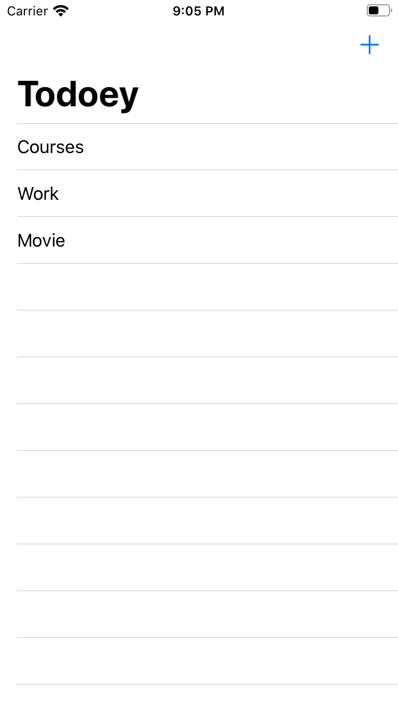
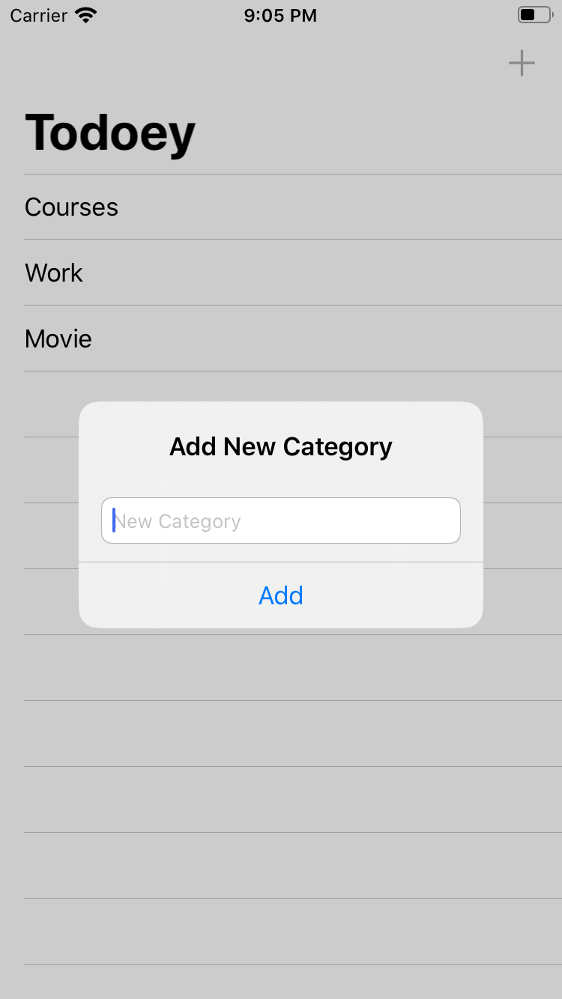
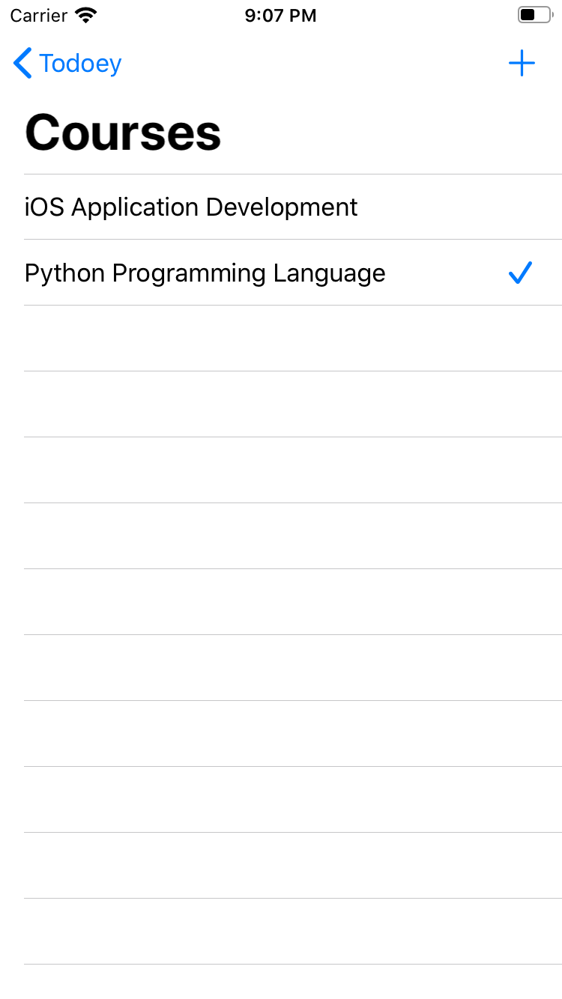
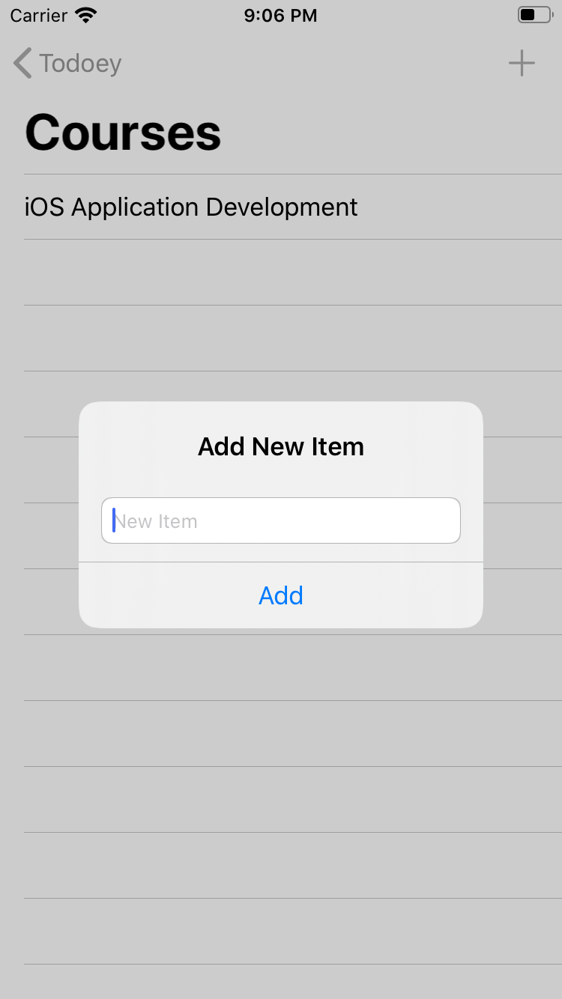
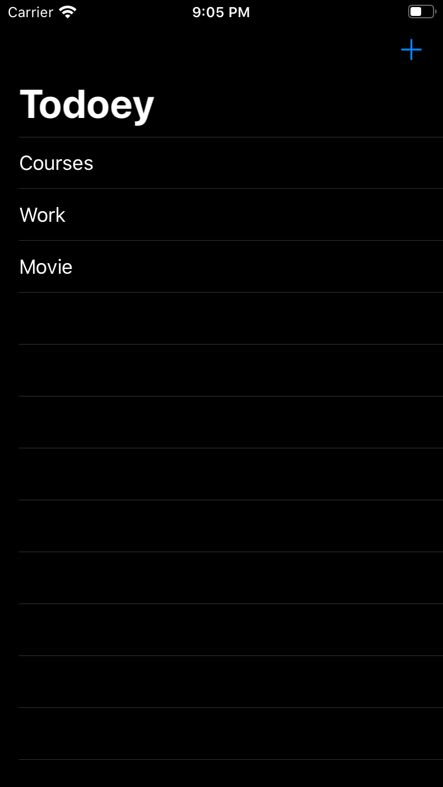
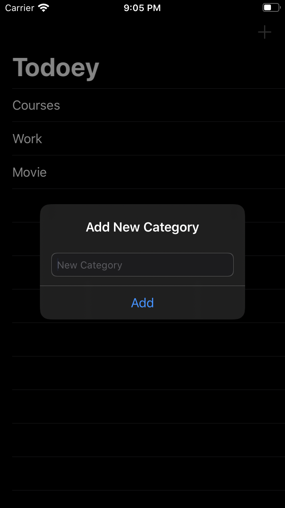
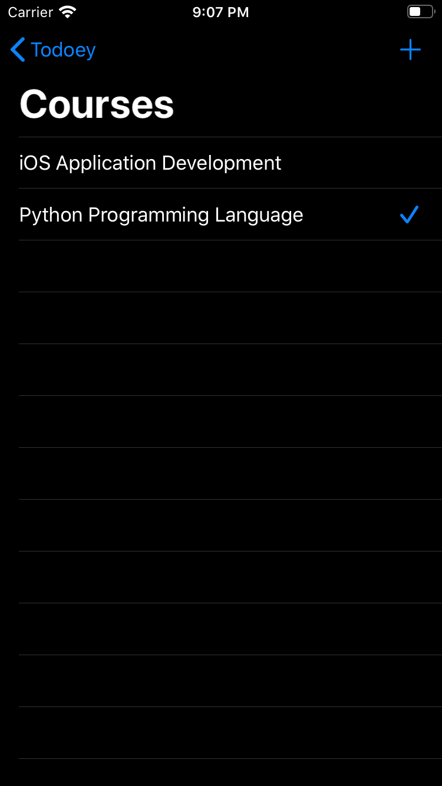

#  Todoey-Realm
A Todo list application with sublist functionality using Realm.

 This application is part of <a href="https://www.udemy.com/course/ios-13-app-development-bootcamp/">iOS Application Bootcamp</a> course by Dr. Angela Yu, <a href="https://www.appbrewery.co">TheAppBrewery</a>.

## Screenshots
   
   

## Technologies
- <a href="http://developer.apple.com/documentation/swift"> Swift Programming Language </a>
- Storyboard
- <a href="https://developer.apple.com/documentation/uikit"> UIKit </a>
    - <a href="https://developer.apple.com/documentation/uikit/uinavigationcontroller">  UINavigationController </a> | <a href="https://developer.apple.com/documentation/uikit/uibarbuttonitem"> UIBarButtonItem </a>
    - <a href="https://developer.apple.com/documentation/uikit/uitableviewcontroller"> UITableViewController </a>
    - <a href="https://developer.apple.com/documentation/uikit/uisearchbar"> UISearchBar </a> | <a href="https://developer.apple.com/documentation/uikit/uisearchbardelegate"> UISearchBarDelegate </a>
    - <a href="https://developer.apple.com/documentation/uikit/uialertcontroller"> UIAlertController </a> | <a href="https://developer.apple.com/documentation/uikit/uialertaction"> UIAlertAction </a> | <a href="https://developer.apple.com/documentation/uikit/uitextfield"> UITextField </a>
- <a href=""> RealmSwift </a>
